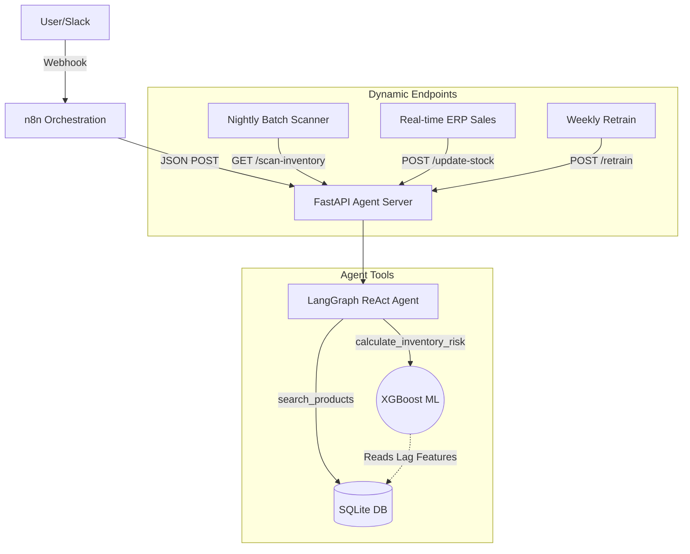

# Hybrid ReAct Agent Architecture

A production-grade, closed-loop AI agent pipeline built with **LangGraph**, **FastAPI**, and **n8n**. This project demonstrates a hybrid reasoning and acting (ReAct) architecture specifically designed for supply chain and inventory risk analysis.

## 🚀 Key Features

* **LangGraph Cognitive Core:** Implements deterministic tool usage with strong system prompt guardrails.
* **Persistent Memory:** Utilizes `SqliteSaver` in WAL mode to handle concurrent conversation state management efficiently.
* **Token Bloat Protection:** Employs `trim_messages` combined with a local `tiktoken` proxy to ensure the context window remains fully optimized without causing API-level HTTP 503 errors.
* **Autonomous Product Search Engine:** Incorporates a Top-K limit (`LIMIT 5`) Entity Resolution algorithm allowing the LLM to search for and list options natively without dropping into Denial-of-Service loops.
* **Machine Learning Demand Forecasting:** Leverages an offline-trained **Quantile XGBoost Regressor** to predict 30-day future demand. It natively outputs probabilistic bounds: `P10` (Optimistic), `P50` (Median, used for primary risk threshold), and `P90` (Conservative/Tail Risk, used for Value-at-Risk reporting).
* **Business & Risk Metrics:** Incorporates advanced feature engineering (`velocity_ratio`) and evaluates intermittent demand using the `MASE` (Mean Absolute Scaled Error) metric alongside `Fill Rate` and `Lost Sales` KPIs.
* **Data-Driven Dynamic Mocking:** Integrates a realistic `csv_to_db.py` pipeline that constructs supply chain dynamics (Safety Stock, Reorder Cycles) proportionally mapped to real historical Amazon Sales Data.
* **Graceful Degradation:** Failsafes and safety net configurations deployed on the FastAPI layer to intercept Recursion Limit crashes and return static operational JSON responses (`risk_level: Error`).
* **Robust API Layer:** Exposes the Agent via an asynchronous FastAPI endpoint, securely handling the orchestration requests.
* **Dynamic Operational Endpoints:** Supports real-time stock updates (`/update-stock`), nightly batch scanning (`/scan-inventory`) with escalation detection, and zero-downtime model retraining (`/retrain`).
* **n8n Ready:** Specifically optimized JSON responses (exposing `requires_alert`, `risk_level`, `demand_forecast`, `business_metrics`) to act as a seamless HTTP Webhook backend for an n8n orchestration flow.
* **Autonomous Database Maintenance:** Cleans historic memory by deciphering UUIDv6 temporal data (`prune_db.py`).

## 🧠 Mimari Diyagram (Architecture)



## 📂 Project Structure

```text
hybrid_react_agent/
├── .env.example         # Environment variables template (OpenAI/Gemini keys)
├── requirements.txt     # Pinned Python dependencies
├── main.py              # Uvicorn entry point
├── agent/               # LangGraph Engine (State, Nodes, Edges, Memory)
├── api/
│   └── server.py        # FastAPI Router with /chat, /scan-inventory, /update-stock, /retrain
├── tools/
│   └── inventory.py     # ReAct tools: calculate_inventory_risk, search_products
├── scripts/
│   ├── csv_to_db.py     # Builds SQLite DB from raw Amazon Sales CSV
│   ├── db_setup.py      # Schema initialization
│   ├── train_model.py   # Trains Quantile XGBoost (P10/P50/P90) demand forecaster
│   └── prune_db.py      # Cleans historic agent memory (UUIDv6-based)
├── models/              # XGBoost .pkl artifact (gitignored — run train_model.py)
├── database/            # SQLite files (gitignored — run csv_to_db.py)
├── notebooks/           # EDA, risk analysis, and model evaluation notebooks
├── llm_context/         # Architecture documentation for LLM context injection
└── tests/               # pytest suite (test_api.py, test_inventory.py, conftest.py)
```

## 🛠️ Quick Start

**1. Clone and Setup Environment**
```bash
python3 -m venv .venv
source .venv/bin/activate
pip install -r requirements.txt
```

**2. Prepare the Data & Train the Machine Learning Model**
Creates the relational database from raw sales data and trains the XGBoost demand forecaster.
```bash
python3 scripts/csv_to_db.py
python3 scripts/train_model.py
```

**3. Configure Environment Variables**
Copy `.env.example` to `.env` and fill in your API keys.
```env
# Choose your provider: 'openai' or 'gemini'
LLM_PROVIDER=gemini

# Provider specific keys
GEMINI_API_KEY=your-gemini-key-here
OPENAI_API_KEY=sk-your-openai-key-here
```

**4. Run the Server**
```bash
uvicorn main:app --host 0.0.0.0 --port 8000 --reload
```
You can now access the interactive swagger docs at `http://localhost:8000/docs`.

## 🤖 API Interface / Endpoints

### POST `/chat`

Request Payload:
```json
{
  "user_id": "unique-session-id-1234",
  "message": "What is the stock risk for product JNE3781-KR-XXXL?"
}
```

Response format with probabilistic demand forecast and n8n-ready alert flag:
```json
{
  "response": "The current stock for JNE3781-KR-XXXL is critically low. Immediate supplier contact is required.",
  "thought_process": [...],
  "tool_used": "calculate_inventory_risk",
  "risk_level": "Critical",
  "requires_alert": true
}
```

The underlying tool returns a full probabilistic payload:
```json
{
  "sku": "JNE3781-KR-XXXL",
  "risk_score": 90,
  "risk_level": "Critical",
  "current_stock": 19,
  "critical_threshold": 18,
  "demand_forecast": {
    "optimistic_p10": 3,
    "median_p50": 16,
    "conservative_p90": 40
  },
  "business_metrics": {
    "tail_risk_demand_p90": 40,
    "var_90_units": 40
  }
}
```

### GET `/scan-inventory`
Runs a nightly batch scan across all SKUs, computes quantile demand forecasts, detects risk escalations, and writes snapshots to `agent_state.db` via UPSERT.

### POST `/update-stock`
Simulates real-time ERP sales by decrementing `current_stock` in the inventory table.
```json
{ "sku": "JNE3781-KR-XXXL", "qty_sold": 5 }
```

### POST `/retrain`
Triggers offline retraining of the XGBoost model via subprocess and reloads the artifact into memory — zero downtime.
