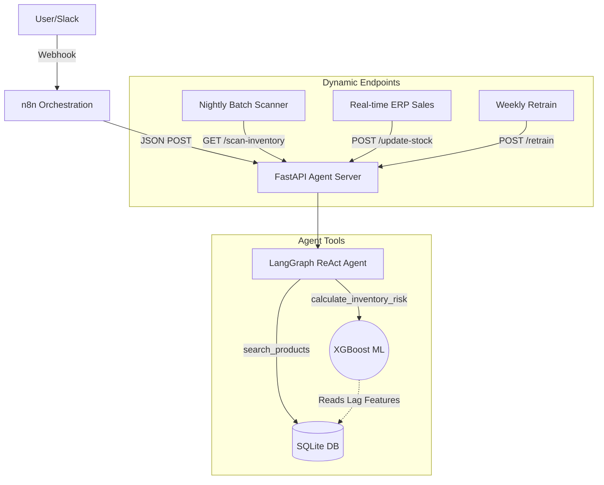

# Hybrid ReAct Agent Architecture

A production-grade, closed-loop AI agent pipeline built with **LangGraph**, **FastAPI**, and **n8n**. This project demonstrates a hybrid reasoning and acting (ReAct) architecture specifically designed for supply chain and inventory risk analysis.

## 🚀 Key Features

* **LangGraph Cognitive Core:** Implements deterministic tool usage with strong system prompt guardrails.
* **Persistent Memory:** Utilizes `SqliteSaver` in WAL mode to handle concurrent conversation state management efficiently.
* **Token Bloat Protection:** Employs `trim_messages` combined with a local `tiktoken` proxy to ensure the context window remains fully optimized without causing API-level HTTP 503 errors.
* **Autonomous Product Search Engine:** Incorporates a Top-K limit (`LIMIT 5`) Entity Resolution algorithm allowing the LLM to search for and list options natively without dropping into Denial-of-Service loops.
* **Machine Learning Demand Forecasting:** Leverages an offline-trained **XGBoost Regressor** to predict 30-day future demand using backward rolling lag features.
* **Data-Driven Dynamic Mocking:** Integrates a realistic `csv_to_db.py` pipeline that constructs supply chain dynamics (Safety Stock, Reorder Cycles) proportionally mapped to real historical Amazon Sales Data.
* **Graceful Degradation:** Failsafes and safety net configurations deployed on the FastAPI layer to intercept Recursion Limit crashes and return static operational JSON responses (`risk_level: Error`).
* **Robust API Layer:** Exposes the Agent via an asynchronous FastAPI endpoint, securely handling the orchestration requests.
* **n8n Ready:** Specifically optimized JSON responses (exposing `tool_used`, `risk_level`) to act as a seamless HTTP Webhook backend for an n8n orchestration flow.
* **Autonomous Database Maintenance:** Cleans historic memory by deciphering UUIDv6 temporal data (`prune_db.py`).

## 🧠 Mimari Diyagram (Architecture)



## 📂 Project Structure

```text
hybrid_react_agent/
├── .env.example         # Environment variables template (OpenAI/Gemini keys)
├── requirements.txt     # Python dependencies
├── database/            # SQLite setup scripts and raw DB files
│   └── database.db      # Automatically populated mock storage limit
├── scripts/             # Utility and lifecycle management scripts
│   └── prune_db.py      # Cleans historic memory by deciphering UUIDv6 temporal data
├── tools/               # ReAct tools (Inventory Analyzer and Top-K Search logic)
├── agent/               # LangGraph Engine (State, Nodes, Edges, Memory)
├── api/                 # FastAPI Router with Graceful Degradation limits
└── main.py              # Uvicorn entry point
```

## 🛠️ Quick Start

**1. Clone and Setup Environment**
```bash
python3 -m venv .venv
source .venv/bin/activate
pip install -r requirements.txt
```

**2. Prepare the Data & Train the Machine Learning Model**
Creates the relational database from raw sales data and trains the XGBoost demand forecaster.
```bash
python3 scripts/csv_to_db.py
python3 scripts/train_model.py
```

**3. Configure Environment Variables**
Edit the `.env` file to select your provider and include the respective API keys. By default, the provider is set to `openai`, but you can easily switch it to `gemini`.
```env
# Choose your provider: 'openai' or 'gemini'
LLM_PROVIDER=gemini

# Provider specific keys
GEMINI_API_KEY=your-gemini-key-here
OPENAI_API_KEY=sk-your-openai-key-here
```

**4. Run the Server**
```bash
uvicorn main:app --host 0.0.0.0 --port 8000 --reload
```
You can now access the interactive swagger docs at `http://localhost:8000/docs`.

## 🤖 API Interface / Endpoint

**POST `/chat`**

Request Payload:
```json
{
  "user_id": "unique-session-id-1234",
  "message": "What is the stock risk for Laptop Pro X?"
}
```

Response format precisely tailored for n8n Conditional logic integration:
```json
{
  "response": "The current stock for Laptop Pro X is critically low. Immediate supplier contact is required.",
  "thought_process": [
    {
       "type": "AIMessage",
       "content": "",
       "tool_calls": [{"name": "calculate_inventory_risk"}]
    }
  ],
  "tool_used": "calculate_inventory_risk",
  "risk_level": "High"
}
```
